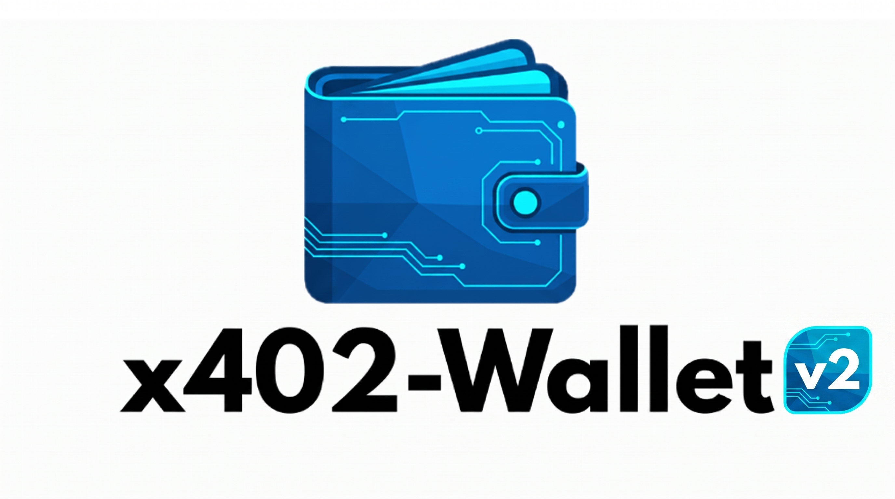

# x402-wallet


A command-line wallet for the [x402 payment protocol](https://x402.org). It creates cryptographic payment authorizations (EIP-3009 signatures) for pay-per-use APIs and manages basic EVM wallet operations — designed to be driven by AI coding agents like Claude Code or Gemini.

> **Fork notice:** This is a fork of [0xKoda/x402-wallet](https://github.com/0xKoda/x402-wallet), restructured and adapted for independent development. All credit for the original implementation goes to the upstream authors.

---

> ### Kurzübersicht (DE)
>
> **x402-wallet** ist ein Kommandozeilen-Wallet für das [x402-Zahlungsprotokoll](https://x402.org). Es erzeugt EIP-3009-Signaturen (gaslose USDC-Überweisungen) und sendet sie als Base64-kodierter `X-PAYMENT`-Header mit — für APIs, die per Abruf bezahlt werden (Pay-per-Use).
>
> - **Netzwerke:** Ethereum, Base (Standard) und Base Sepolia (Testnet)
> - **Schlüsselspeicher:** `.env`-Datei (Klartext, automationsfreundlich) oder verschlüsselter Keystore (XChaCha20-Poly1305 + Argon2)
> - **Zusatzfunktionen:** ETH-/ERC20-Guthaben abfragen, ETH/Token versenden
> - **Ausgelegt für KI-Agents** (Claude Code, Gemini etc.): saubere Stdout-Ausgaben, keine Passwort-Prompts nötig
>
> ⚠️ **Sicherheit:** Nur ein dediziertes Wallet mit kleinen Beträgen ($1–10) verwenden, niemals das Haupt-Wallet oder Seed-Phrase. Erst auf Base Sepolia testen. Software ist in aktiver Entwicklung, ohne Garantie.

---

## ⚠️ Active Development — Use at Your Own Risk

This software may contain bugs and experience breaking changes. **No warranty is provided.** You are solely responsible for the security of your private keys and any loss of funds.

- Private keys are stored locally (`.env` plaintext or encrypted keystore) — a compromised machine means stolen funds
- EIP-3009 signatures authorize token transfers and **cannot be revoked once signed** — treat them like signed checks
- Use a dedicated wallet with **minimal funds** ($1–10 USDC); never your main wallet or seed phrase
- Test on Base Sepolia first; review the code before trusting it with real funds

## Features

- **x402 payments** — create EIP-3009 payment signatures for x402-protected APIs (`X-PAYMENT` header, Base64-encoded)
- **Multi-network** — Ethereum, Base (default), Base Sepolia, with custom RPC support
- **Two key-storage modes** — automation-friendly `.env` file or encrypted keystore (XChaCha20-Poly1305 + Argon2)
- **Wallet operations** — check ETH/ERC20 balances, send ETH and ERC20 tokens
- **Agent-friendly** — clean stdout output on every command, designed for LLM coding agents

## Quick Start

### Install

```
git clone https://github.com/wurminator/x402-wallet
cd x402-wallet
cargo build --release
```

The binary is at `./target/release/x402-wallet` (add it to your `PATH` if you like).

> Optional experimental feature (currently **not wired up** in the code, only declared in `Cargo.toml`): `cargo build --release --features mcp`

### Set up a key

Pick one of two storage modes:

| | `.env` file (default) | Encrypted keystore |
|---|---|---|
| Command | `x402-wallet wallet-init` | `x402-wallet wallet-init --keystore` |
| Storage | `X402_WALLET_PRIVATE_KEY` in `./.env` (plaintext) | `~/.x402wallet/keystore.json` (encrypted) |
| Password prompt | None — works in scripts and agents | Every command prompts for the passphrase |
| Suitability | Automation, AI agents, testing, minimal funds | Manual/interactive use only |

Both modes ask `Create new private key (y/N)?` — `y` generates a fresh key, `N` imports an existing one (`0x…` or bare hex, input hidden). The wallet address is printed on success.

### Fund the wallet

1. Get your address: `x402-wallet wallet-address`
2. Send a small amount of USDC on Base to that address ($1–10 recommended)
3. Verify: `x402-wallet balance --erc20 0x833589fCD6eDb6E08f4c7C32D4f71b54bdA02913` (native USDC on Base)

Alternatively, import an existing key with minimal funds during `wallet-init`.

## Usage

For smooth agent operation, give the LLM context: reference [wallet.md](wallet.md) for detailed instructions and [resource-list.md](resource-list.md) for the list of payable resources.

### Pay for an x402-protected API

```
# 1. Request the resource — server answers 402 Payment Required
curl -X POST https://api.example.com/endpoint

# 2. Create the payment signature from the 402 response fields
#    payTo -> --pay-to, asset -> --token, maxAmountRequired -> --amount
x402-wallet create-payment \
  --pay-to 0xRECIPIENT_ADDRESS \
  --token 0xUSDC_ADDRESS \
  --amount 10000 \
  --token-name "USD Coin" \
  --token-version "2" > payment.txt

# 3. Retry with the payment header
curl -X POST \
  -H "X-PAYMENT: $(cat payment.txt)" \
  https://api.example.com/endpoint
```

`create-payment` writes **only** the Base64 header to stdout — no extra text — so it can be captured directly in scripts.

### Wallet operations

```
# Balances (ETH, or any ERC20 token)
x402-wallet balance
x402-wallet balance --erc20 0x833589fCD6eDb6E08f4c7C32D4f71b54bdA02913

# Send funds
x402-wallet send-eth  --to 0xRECIPIENT --eth 0.1
x402-wallet send-erc20 --token 0x833589fCD6eDb6E08f4c7C32D4f71b54bdA02913 --to 0xRECIPIENT --amount 10.5
```

## Commands Reference

```
wallet-init               Initialize a wallet (create or import a private key)
  --keystore              Use encrypted keystore (breaks automation)
  --dotenv PATH           Use .env file at PATH (default: ./.env)

wallet-address            Display wallet address

config-set                Configure network
  --network NAME          ethereum | base | base-sepolia (aliases: eth, base_sepolia)
  --rpc URL               Custom RPC endpoint (optional)

balance                   Check balance (raw amount on stdout)
  --erc20 ADDRESS         Token address (omit for ETH)

send-eth                  Send ETH
  --to ADDRESS            Recipient
  --eth AMOUNT            Amount in ETH (e.g. "0.1")

send-erc20                Send ERC20 tokens
  --token ADDRESS         Token contract
  --to ADDRESS            Recipient
  --amount AMOUNT         Amount in token units (e.g. "10.5")

create-payment            Create x402 payment signature (Base64 X-PAYMENT header on stdout)
  --pay-to ADDRESS        Recipient (from 402 response: accepts[0].payTo)
  --token ADDRESS         Token contract (accepts[0].asset)
  --amount UNITS          Amount in smallest units (accepts[0].maxAmountRequired)
  --token-name NAME       EIP-712 domain name (accepts[0].extra.name; default: "USD Coin")
  --token-version VER     EIP-712 domain version (accepts[0].extra.version; default: "2")
```

## How It Works

The wallet implements the **"exact"** x402 scheme using **[EIP-3009](https://eips.ethereum.org/EIPS/eip-3009)** (`TransferWithAuthorization`):

1. `create-payment` builds an EIP-712 typed-data message (payer, recipient, amount, 32-byte random nonce, validity window) and signs it with your key
2. The signature is packed into a payment payload (`x402Version: 1`, scheme `exact`) and Base64-encoded as the `X-PAYMENT` header
3. The recipient redeems the authorization on-chain — **you pay no gas**; the transfer is executed by the payee using your signature

Payments are **time-limited** (10 minutes), **stateless** (no funds locked if the header is intercepted), and **non-revocable** once signed.

## Configuration

Stored at `~/.x402wallet/config.json` (Windows: `%USERPROFILE%\.x402wallet\config.json`):

```json
{
  "network": "base",
  "rpc": {
    "ethereum": "https://cloudflare-eth.com",
    "base": "https://mainnet.base.org",
    "base-sepolia": "https://sepolia.base.org"
  }
}
```

| Network | Chain ID | Default RPC | Aliases |
|---------|----------|-------------|---------|
| Ethereum | 1 | `https://cloudflare-eth.com` | `eth` |
| Base *(default)* | 8453 | `https://mainnet.base.org` | — |
| Base Sepolia | 84532 | `https://sepolia.base.org` | `base_sepolia`, `base-sepolia-testnet` |

```
x402-wallet config-set --network base-sepolia
x402-wallet config-set --network base --rpc https://your-rpc.example
```

The provider verifies that the RPC's chain ID matches the configured network on every request.

## Security

**Key storage:**

- `.env` mode: plaintext key in `./.env`, file permissions set to `0600` on Unix (newly created files only); readable by anything with filesystem access
- Keystore mode: `~/.x402wallet/keystore.json`, encrypted with XChaCha20-Poly1305, key derived via Argon2 (memory-hard); passphrase is zeroized after use; still vulnerable to keyloggers or memory access

**Best practices:**

1. Keep only minimal funds in this wallet
2. Use a dedicated wallet — don't reuse keys from other applications
3. Test on Base Sepolia before mainnet
4. Understand what you sign — payment authorizations are like signed checks
5. Secure your machine (full-disk encryption, strong passwords)

## Use with AI Agents

The CLI is designed for LLM coding agents (Claude Code, Gemini Code Assist, …):

- Agents **must use the `.env` method** — they cannot answer keystore passphrase prompts
- `balance` and `create-payment` print bare values (script-friendly); transfers print a labeled transaction hash
- Give the agent [wallet.md](wallet.md) as usage context and [resource-list.md](resource-list.md) as its list of payable resources

Typical flow: agent hits a 402 → parses `accepts[0]` from the response → runs `create-payment` → retries the request with the `X-PAYMENT` header.

## Troubleshooting

| Problem | Fix |
|---------|-----|
| `RPC chain ID mismatch` | `config-set --network <name>` with the matching network, or set a correct `--rpc` |
| `No private key` | Run `wallet-init`, or set `X402_WALLET_PRIVATE_KEY` in `.env` |
| `Unlock keystore passphrase:` blocks script/agent | Delete `~/.x402wallet/keystore.json` and re-run `wallet-init` (`.env` mode) |
| `transaction dropped from mempool` | Usually insufficient ETH for gas — check `balance` |
| Payment authorization rejected | `--token-name`/`--token-version` must match the 402 response `extra` fields exactly |

## Contributing

Contributions are welcome!

1. Fork this repository
2. Create a feature branch
3. Make your changes with tests
4. Submit a pull request

By contributing, you agree to license your contributions under AGPL-3.0.

## License

**AGPL-3.0** — see [LICENSE](LICENSE). This ensures services built on this wallet contribute back by open-sourcing their code; contact the maintainers for commercial licensing options.

## Disclaimer

THE SOFTWARE IS PROVIDED "AS IS", WITHOUT WARRANTY OF ANY KIND, EXPRESS OR IMPLIED. IN NO EVENT SHALL THE AUTHORS OR COPYRIGHT HOLDERS BE LIABLE FOR ANY CLAIM, DAMAGES OR OTHER LIABILITY. You are solely responsible for securing your private keys, any loss of funds, and complying with applicable laws.

## Links

- [Upstream repository (0xKoda/x402-wallet)](https://github.com/0xKoda/x402-wallet)
- [X402 Protocol](https://x402.org) · [X402 Documentation](https://x402.gitbook.io/x402)
- [EIP-3009 Specification](https://eips.ethereum.org/EIPS/eip-3009)
- [Recaipe API](https://app.recaipe.com) — example x402-protected service
- [AGPL-3.0 License](https://www.gnu.org/licenses/agpl-3.0.en.html)

---

**Built for the x402 ecosystem** — making APIs payable with crypto, one request at a time.
